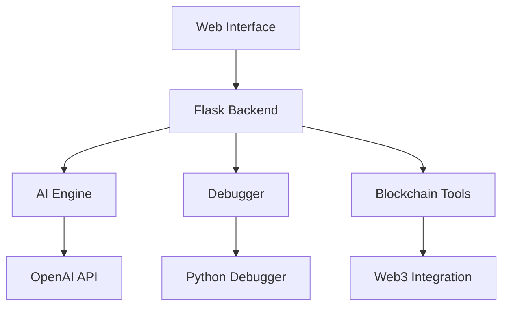

# Inoxx AI-Assisted IDE Documentation
Version 1.0.0 | March 2025

## Table of Contents
1. [Introduction](#introduction)
2. [Features Overview](#features-overview)
3. [Architecture](#architecture)
4. [Feature Details](#feature-details)
5. [Code Examples](#code-examples)
6. [API Reference](#api-reference)

## Introduction
Inoxx AI-Assisted IDE is a powerful development environment that combines advanced AI capabilities with professional development tools. This document provides comprehensive documentation of all features and components.

## Features Overview

### 1. DevHub
- Real-time code editing
- Syntax highlighting
- Advanced debugging features
- Code analysis and documentation generation
- AI-assisted code completion

### 2. AI Smart Code
- Natural language to code generation
- Intelligent code suggestions
- Context-aware completions
- Code optimization recommendations

### 3. DeFi Dev
- Smart contract development
- Blockchain integration
- Contract compilation and verification
- Gas estimation and optimization
- Deployment management

## Architecture



## Feature Details

### DevHub

#### Real-time Debugging
```python
class InoxxDebugger(bdb.Bdb):
    """Custom debugger implementation for Inoxx IDE."""
    def __init__(self):
        super().__init__()
        self.breakpoints: Dict[str, List[int]] = {}
        self.current_frame = None
        self.is_running = False
        # ... other initialization code
```

Key Features:
- Breakpoint Management
- Variable Inspection
- Call Stack Analysis
- Step-by-step Execution
- Real-time State Updates

#### Code Analysis
The IDE provides comprehensive code analysis through integrated AI capabilities:
```python
@app.route('/api/analyze', methods=['POST'])
def analyze_code():
    try:
        code = request.json.get('code', '')
        ide.code_editor.content = code
        analysis = ide.code_editor.analyze_current_code()
        return jsonify(analysis)
    except Exception as e:
        return jsonify({"error": str(e)}), 500
```

### AI Smart Code

#### Code Generation
The AI-powered code generation feature uses OpenAI's GPT model:
```python
response = openai.chat.completions.create(
    model="gpt-4o",
    messages=[
        {
            "role": "system",
            "content": """Generate focused Python code solutions. Follow these guidelines:
            1. Create concise, efficient implementations
            2. Use standard library when possible
            3. Include brief comments for clarity"""
        },
        {
            "role": "user",
            "content": prompt
        }
    ],
    response_format={"type": "json_object"},
    temperature=0.2
)
```

### DeFi Dev

#### Smart Contract Development
```solidity
// Example Smart Contract
contract MyContract {
    string public message;

    constructor() {
        message = "Hello, Blockchain!";
    }

    function setMessage(string memory newMessage) public {
        message = newMessage;
    }
}
```

#### Contract Deployment
```python
def deploy_contract(self, compiled_contract: Dict[str, Any], contract_name: str) -> Dict[str, Any]:
    """Deploy a compiled contract to the blockchain."""
    try:
        # Get contract data
        contract_data = compiled_contract['contracts'][f"{contract_name}.sol"][contract_name]
        bytecode = contract_data['evm']['bytecode']['object']
        abi = json.loads(contract_data['metadata'])['output']['abi']
        # ... deployment logic
    except Exception as e:
        return {"success": False, "error": str(e)}
```

## API Reference

### Code Analysis Endpoints
- `POST /api/analyze`
- `POST /api/document`
- `POST /api/complete`

### Debugging Endpoints
- `POST /api/debug/start`
- `POST /api/debug/stop`
- `POST /api/debug/step`
- `POST /api/debug/breakpoint`
- `GET /api/debug/state`

### Blockchain Endpoints
- `POST /api/blockchain/compile`
- `POST /api/blockchain/verify`
- `POST /api/blockchain/estimate-gas`
- `POST /api/blockchain/deploy`

## User Interface

### Navigation
The IDE features a collapsible left-side navigation with three main sections:
1. DevHub - Main development environment
2. AI Smart Code - AI-powered code generation
3. DeFi Dev - Blockchain development tools

### Theme
The interface uses a terminal-inspired theme with:
- Background: #1e1e1e
- Accent: #39ff14 (Terminal Green)
- Text: #00ff00

### Layout Components
```css
:root {
    --bg-color: #1e1e1e;
    --text-color: #00ff00;
    --terminal-green: #39ff14;
    --accent-color: #2a5298;
    --border-color: #39ff14;
    --tab-bg: #2d2d2d;
    --hover-color: #3d3d3d;
}
```

## Development Stack
- Frontend: HTML5, CSS3, JavaScript
- Backend: Python, Flask
- Editor: Monaco Editor
- AI Integration: OpenAI API
- Blockchain: Web3.py, Solidity

## Installation and Setup
1. Clone the repository
2. Install dependencies
3. Set up environment variables
4. Run the development server

## Security Considerations
- API Key Management
- Secure Blockchain Transactions
- Code Execution Safety
- Error Handling

## Performance Optimization
- Efficient API Calls
- Caching Mechanisms
- Resource Management
